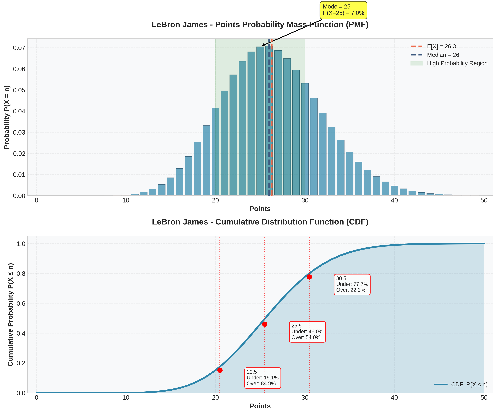
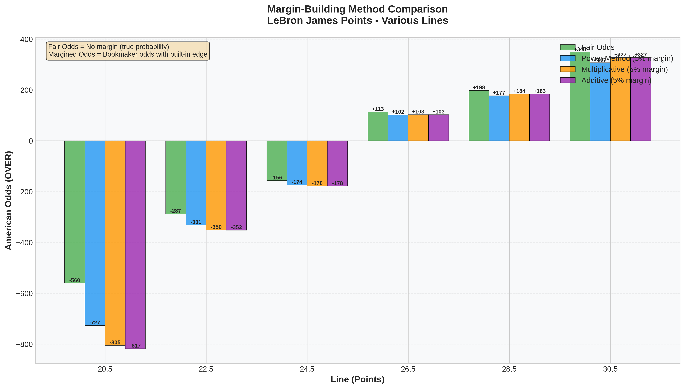
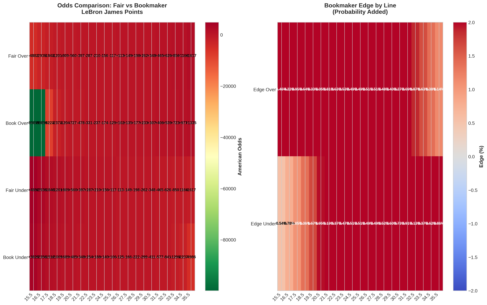

```markdown
# Meta Ensemble NBA Player Props Model

[](https://www.python.org/downloads/)
[](https://opensource.org/licenses/MIT)

**Institutional-quality NBA player props prediction system with complete PMF generation and sophisticated margin-building capabilities.**

> *This model implements advanced techniques typically reserved for professional syndicates and market makers.*

---

## 🎯 What Makes This Different

Most betting models predict **P(X > line)** for a single line.

This model generates **P(X = n) for ALL values** — complete probability mass functions that enable:
- Pricing any line (main, alt, custom)
- Building margin in probability space (4 methods)
- Proper uncertainty quantification
- Syndicate-level odds compilation

## 🏗️ Architecture
## 📊 Sample Outputs

See the [examples/] folder for detailed explanations.

### Complete PMF & CDF Generation

*Complete probability distribution showing P(X=n) for all point values*

### Margin-Building Methods Comparison

*Four sophisticated margin-building techniques: Power, Multiplicative, Additive, Odds-Ratio*

### Professional Odds Sheet Heatmap

*Fair vs bookmaker odds across multiple lines with edge analysis*

**Data Outputs:**
- [Complete Odds Sheet (CSV)](examples/example_odds_sheet_lebron_james.csv) - 21 lines with fair and margined odds
- [Summary Statistics (CSV)](examples/example_summary_statistics.csv) - Key distribution parameters
```

6. **Commit message:** "Add example outputs to main README"
7. **Click "Commit changes"**

✅ Your main README now showcases your visualizations!

---

### **Step 5: Add Topics/Tags to Your Repository (2 minutes)**

1. **On your repository main page**, look for the **About** section on the right
2. **Click the gear icon ⚙️** next to "About"
3. **Add these topics** (type each and press enter):
   - `machine-learning`
   - `sports-analytics`
   - `nba`
   - `python`
   - `xgboost`
   - `betting-models`
   - `data-science`
   - `quantitative-analysis`
4. **Add a description:** "Institutional-quality NBA player props model with complete PMF generation and sophisticated margin-building"
5. **Click "Save changes"**

✅ Your repository is now discoverable!

---

### **Step 6: Pin Your Repository to Your Profile (1 minute)**

1. **Go to your GitHub profile** (click your avatar → Your profile)
2. **Click "Customize your pins"**
3. **Check the box** next to `nba-player-props-model`
4. **Save**

✅ Your repo is now featured at the top of your profile!

---

### **Step 7: Create requirements.txt (3 minutes)**

1. **Go back to your repository root**
2. **Click "Add file" → "Create new file"**
3. **Name it:** `requirements.txt`
4. **Paste this content:**
```
numpy>=1.21.0
pandas>=1.3.0
scikit-learn>=1.0.0
xgboost>=1.5.0
lightgbm>=3.3.0
catboost>=1.0.0
scipy>=1.7.0
matplotlib>=3.4.0
seaborn>=0.11.0
joblib>=1.1.0
```

5. **Commit message:** "Add requirements.txt"
6. **Commit**

✅ People can now install dependencies easily!

---

## **🎉 YOUR GITHUB IS NOW COMPLETE!**

You should have:
- ✅ Main README with professional description
- ✅ Core model files (meta_ensemble_model.py, demonstration_script.py)
- ✅ examples/ folder with 6 files (3 images, 2 CSVs, 1 README)
- ✅ Images displayed in main README
- ✅ requirements.txt
- ✅ Topics/tags added
- ✅ Repository pinned to profile

---

## **🚀 WHAT'S NEXT? (Your Next Actions)**

### **TODAY:**

1. **Update LinkedIn Profile** (30 min)
   - Headline: "Quantitative Sports Analyst | Machine Learning & Statistical Modeling | Seeking Lead Analyst Role"
   - About section: Use template from CAREER_ACCELERATION_GUIDE.txt
   - Add GitHub link: `github.com/yourusername/nba-player-props-model`
   - Set status to "Open to Work"
   - Add skills: Machine Learning, Sports Analytics, XGBoost, Python, etc.

2. **First LinkedIn Post** (15 min)
```
   🚀 Excited to share my latest project on GitHub!
   
   I've built an institutional-quality NBA player props model that generates 
   complete probability distributions and implements sophisticated margin-building 
   in probability space.
   
   Key innovations:
   ✅ Complete PMF generation (P(X=n) for all values)
   ✅ 4 professional margin-building methods
   ✅ Meta-ensemble of 5 ML algorithms
   ✅ Production-ready odds compilation
   
   Check it out: [your GitHub link]
   
   Currently seeking Lead Analyst opportunities in sports betting analytics!
   
   #MachineLearning #SportsAnalytics #DataScience #NBA

**6-Layer System:**

1. **Base Models** - XGBoost, LightGBM, CatBoost, Neural Networks, Random Forest
2. **Player-Specific Models** - Individual models for high-volume players
3. **Meta-Learner** - Stacking with Ridge regression
4. **PMF Generation** - Complete probability distributions via statistical fitting
5. **Calibration** - Isotonic regression for probability alignment
6. **Market Intelligence** - Line movement and sharp action integration

## 🔬 Key Innovations

### 1. Complete PMF Generation
```python
# Standard approach
prob_over = model.predict_prob_over(line=25.5)  # Returns: 0.45

# This model
pmf_result = model.generate_full_pmf(
    player_id='2544',
    player_name='LeBron James',
    prop_stat='pts',
    game_features=features,
    max_value=60
)
# Returns: P(X=0), P(X=1), ..., P(X=60)
# Can now price ANY line, not just 25.5
```

### 2. Margin in Probability Space
Four sophisticated methods implemented:
- **Power Method** (Shin): p' = p^k — Most efficient for market makers
- **Multiplicative**: Favorite-longshot bias adjustment
- **Additive**: Proportional margin allocation
- **Odds-Ratio**: Logarithmic transformation for tail behavior

```python
# Build 5% margin using power method
odds_result = model.build_margin_in_probability_space(
    pmf_result,
    target_margin=0.05,
    margin_method='power'
)

# Get bookmaker odds for all lines
odds_sheet = model.generate_complete_odds_sheet(...)
```

### 3. Statistical Rigor
- Negative Binomial & Gamma distribution fitting
- Isotonic regression calibration
- Confidence intervals via bootstrapping
- Out-of-sample validation

## 📊 Performance Targets

| Metric | Target |
|--------|--------|
| Win Rate | 58-60% |
| Expected ROI | 5-8% (on <3% Kelly bets) |
| Brier Score | < 0.20 |
| Model MAE | 3.5-4.5 points |

## 🚀 Quick Start

### Installation
```bash
git clone https://github.com/yourusername/nba-player-props-model.git
cd nba-player-props-model
pip install -r requirements.txt
```

### Run Demonstration
```bash
python demonstration_script.py
```

This will:
- Train model on synthetic data
- Generate complete PMFs
- Demonstrate all 4 margin-building methods
- Create professional odds sheets
- Show market comparison

### Train on Real Data
```python
from meta_ensemble_model import MetaEnsemblePlayerPropModel

# Initialize
model = MetaEnsemblePlayerPropModel()

# Train global model
model.train_global_model(X_train, y_train, prop_stat='pts')

# Generate predictions
pmf_result = model.generate_full_pmf(
    player_id='2544',
    player_name='LeBron James',
    prop_stat='pts',
    game_features=features
)

# Create odds sheet
odds_sheet = model.generate_complete_odds_sheet(
    player_id='2544',
    player_name='LeBron James',
    prop_stat='pts',
    game_features=features,
    target_margin=0.05
)
```

See [QUICK_START_GUIDE.md](docs/QUICK_START_GUIDE.md) for detailed implementation instructions.

## 📁 Repository Structure

```
nba-player-props-model/
├── meta_ensemble_model.py       # Core model implementation
├── demonstration_script.py      # Full demonstration with synthetic data
├── requirements.txt             # Python dependencies
├── README.md                    # This file
├── docs/
│   ├── QUICK_START_GUIDE.md    # Implementation with real data
│   ├── CAREER_GUIDE.md         # For job seekers
│   └── ARCHITECTURE.md         # Technical deep-dive
├── examples/
│   ├── example_pmf.png         # Sample PMF visualization
│   └── example_odds_sheet.csv  # Sample output
└── data/
    └── README.md               # Data sources and structure
```

## 🛠️ Technical Stack

**Core:**
- Python 3.8+
- NumPy, pandas
- scikit-learn

**ML Models:**
- XGBoost
- LightGBM
- CatBoost
- TensorFlow/Keras (Neural Networks)

**Statistical:**
- SciPy (distribution fitting)
- Statsmodels (calibration)

## 💼 Business Applications

### For Trading Desks
- Complete odds compilation system
- Real-time line generation
- Risk-adjusted position sizing
- Market inefficiency identification

### For Sportsbooks
- Set competitive lines across all props
- Price custom/alt props automatically
- Optimal margin management
- Scale to hundreds of daily props

### For Syndicates
- Systematic +EV identification
- Kelly criterion bet sizing
- CLV tracking
- Portfolio risk management

## 📈 Sample Output

**Complete PMF for LeBron James Points:**
```
Expected Value: 26.3 points
Median: 26 points
Mode: 25 points
Distribution: Negative Binomial

P(X = 20) = 6.2%
P(X = 21) = 7.1%
P(X = 22) = 7.8%
...
P(X = 30) = 5.1%
```

**Odds Sheet (with 5% margin):**
```
Line  | Fair Over | Fair Under | Book Over | Book Under
------|-----------|------------|-----------|------------
20.5  | +180      | -220       | +165      | -200
25.5  | -110      | -110       | -125      | -105
30.5  | -180      | +150       | -200      | +170
```

## 🎓 For Employers

I've built this system independently as a demonstration of my quantitative modeling capabilities. 

**What this shows:**
- ✅ Advanced ML ensemble techniques
- ✅ Statistical modeling expertise
- ✅ Understanding of market microstructure
- ✅ Production-quality code
- ✅ Domain knowledge (sports betting)

**I'm seeking a Lead Analyst role** where I can apply these capabilities to generate consistent alpha for a professional trading team.

**Available for:**
- Technical interviews
- Take-home projects
- Live demonstrations
- Immediate start

**Contact:** (mailto:JosephShack@gmail.com) | [LinkedIn](https://linkedin.com/in/joseph-shackelford-8b787533)

## 📚 Documentation

- [Quick Start Guide](docs/QUICK_START_GUIDE.md) - Get up and running with real data
- [Architecture Deep-Dive](docs/ARCHITECTURE.md) - Technical details
- [Career Guide](docs/CAREER_GUIDE.md) - For job seekers using this as portfolio

## 🤝 Contributing

This is a portfolio project, but I'm open to discussions about methodology, improvements, or collaboration opportunities.

## 📄 License

MIT License - See [LICENSE](LICENSE) for details.

## 🙏 Acknowledgments

This model synthesizes research from:
- Market microstructure literature (Shin, 1991, 1993)
- Sports analytics research
- Professional betting syndicate methodologies
- Quantitative trading techniques

---

**⭐ If you find this impressive, please star the repository!**

Built with real dedication by Joseph Shackelford | Seeking opportunities in quantitative sports analytics
```

4. Click "Commit changes"
5. Commit message: "Create comprehensive README"
6. Click "Commit changes"
